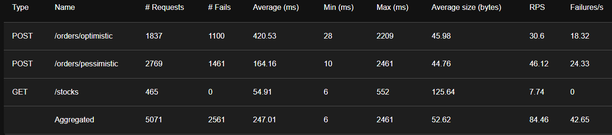
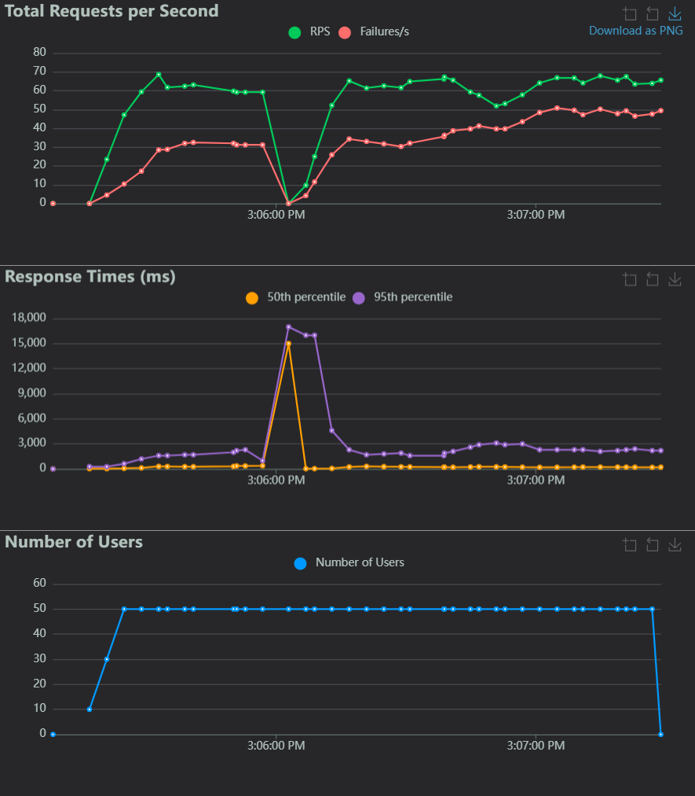
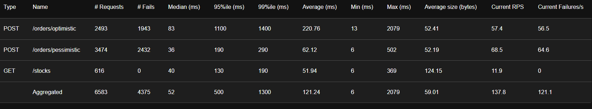

ÉTS - LOG430 - Architecture logicielle - Hiver 2026

Étudiant(e) : Laurent St-Hilaire

# Questions
(Il est obligatoire d'ajouter du code, des captures d'écran ou des sorties de terminal pour illustrer chacune de vos réponses.)

## 1.    Quelle est la sortie du terminal que vous obtenez? Si vous répétez cette commande sur yugabyte2 et yugabyte3, est-ce que la sortie est identique? Illustrez votre réponse avec des captures d'écran ou des sorties du terminal.

La réponse est identique sur yugabyte2 et yugabyte3

sh-4.4# ysqlsh -h yugabyte1 -U yugabyte -c "SELECT * FROM orders;"
 id  | user_id | total_amount | payment_link | is_paid |          created_at           
-----+---------+--------------+--------------+---------+-------------------------------
   1 |       1 |         5.75 |              | f       | 2026-03-30 19:16:48.369529+00
 101 |       1 |         5.75 |              | f       | 2026-03-30 19:16:48.414231+00
   2 |       1 |         5.75 |              | f       | 2026-03-30 19:16:48.769293+00
   3 |       2 |         5.75 |              | f       | 2026-03-30 19:16:48.835794+00
(4 rows)

## 2.   Observez la latence moyenne des deux approches affichée dans la sortie du test. Laquelle a la latence moyenne la plus élevée et pourquoi? Illustrez votre réponse avec les sorties du terminal.

La latence pour la méthode optimiste est plus élevée puisque la méthode doit vérifier si la version de la donnée est la même ou elle est différente. Si elle est différente, le processus est réessayé jusqu'au nombre maximum d'essais. En comparaison, la méthode pessimiste bloque toutes les transactions jusqu'à ce que la transaction en cours soit terminée.

 python tests/concurrency_test.py --threads 20 --product 3

============================================================
2026-03-30 19:24:27 - concurrency_test - DEBUG -   Stratégie : Pessimiste (SELECT FOR UPDATE)
2026-03-30 19:24:27 - concurrency_test - DEBUG -   Endpoint  : /orders/pessimistic
2026-03-30 19:24:27 - concurrency_test - DEBUG -   Threads   : 20  (tous libérés simultanément)
2026-03-30 19:24:27 - concurrency_test - DEBUG -   Article   : 3
2026-03-30 19:24:27 - concurrency_test - DEBUG - ============================================================
2026-03-30 19:24:27 - concurrency_test - DEBUG -   Stocks réinitialisés ✓

2026-03-30 19:24:28 - concurrency_test - DEBUG - 
  Résultat : 2 commande(s) réussie(s), 18 échouée(s) sur 20 threads
2026-03-30 19:24:28 - concurrency_test - DEBUG -   Latence moyenne (succès)  : 0.154s
2026-03-30 19:24:28 - concurrency_test - DEBUG -   Latence moyenne (échecs)  : 0.305s
2026-03-30 19:24:28 - concurrency_test - DEBUG -   Latence moyenne (total)   : 0.29s
2026-03-30 19:24:28 - concurrency_test - DEBUG - 

============================================================
2026-03-30 19:24:28 - concurrency_test - DEBUG -   Stratégie : Optimiste  (version + UPDATE conditionnel)
2026-03-30 19:24:28 - concurrency_test - DEBUG -   Endpoint  : /orders/optimistic
2026-03-30 19:24:28 - concurrency_test - DEBUG -   Threads   : 20  (tous libérés simultanément)
2026-03-30 19:24:28 - concurrency_test - DEBUG -   Article   : 3
2026-03-30 19:24:28 - concurrency_test - DEBUG - ============================================================
2026-03-30 19:24:28 - concurrency_test - DEBUG -   Stocks réinitialisés ✓

2026-03-30 19:24:28 - concurrency_test - DEBUG - 
  Résultat : 2 commande(s) réussie(s), 18 échouée(s) sur 20 threads
2026-03-30 19:24:28 - concurrency_test - DEBUG -   Latence moyenne (succès)  : 0.128s
2026-03-30 19:24:28 - concurrency_test - DEBUG -   Latence moyenne (échecs)  : 0.416s
2026-03-30 19:24:28 - concurrency_test - DEBUG -   Latence moyenne (total)   : 0.388s
2026-03-30 19:24:28 - concurrency_test - DEBUG - 
✔ Tests terminés.

## 3.   Répétez le test avec 5 threads au lieu de 20. Quelle approche a actuellement la latence moyenne la plus élevée et pourquoi? Illustrez votre réponse avec les sorties du terminal.

L'approche avec la latence la plus élevée est la pessimiste puisque chaque opération doit attendre que l'opération précédente soit terminée et que le verrou soit retiré. L'approche optimiste a moins de threads simultanés, donc il y a moins d'essais ce qui diminue la latence.

 python tests/concurrency_test.py --threads 5 --product 3
2026-04-02 18:44:30 - concurrency_test - DEBUG -
╔══════════════════════════════════════════════════════════╗
2026-04-02 18:44:30 - concurrency_test - DEBUG - ║        Test de concurrence – Verrous distribués          ║
2026-04-02 18:44:30 - concurrency_test - DEBUG - ╚══════════════════════════════════════════════════════════╝
2026-04-02 18:44:30 - concurrency_test - DEBUG -   Hôte    : http://localhost:5000
2026-04-02 18:44:30 - concurrency_test - DEBUG -   Threads : 5
2026-04-02 18:44:30 - concurrency_test - DEBUG -   Produit : 3
2026-04-02 18:44:30 - concurrency_test - DEBUG -
============================================================
2026-04-02 18:44:30 - concurrency_test - DEBUG -   Stratégie : Pessimiste (SELECT FOR UPDATE)
2026-04-02 18:44:30 - concurrency_test - DEBUG -   Endpoint  : /orders/pessimistic
2026-04-02 18:44:30 - concurrency_test - DEBUG -   Threads   : 5  (tous libérés simultanément)
2026-04-02 18:44:30 - concurrency_test - DEBUG -   Article   : 3
2026-04-02 18:44:30 - concurrency_test - DEBUG - ============================================================
2026-04-02 18:44:30 - concurrency_test - DEBUG -   Stocks réinitialisés ✓
2026-04-02 18:44:30 - concurrency_test - DEBUG -
  Résultat : 2 commande(s) réussie(s), 3 échouée(s) sur 5 threads
2026-04-02 18:44:30 - concurrency_test - DEBUG -   Latence moyenne (succès)  : 0.281s
2026-04-02 18:44:30 - concurrency_test - DEBUG -   Latence moyenne (échecs)  : 0.374s
2026-04-02 18:44:30 - concurrency_test - DEBUG -   Latence moyenne (total)   : 0.336s
2026-04-02 18:44:30 - concurrency_test - DEBUG -
============================================================
2026-04-02 18:44:30 - concurrency_test - DEBUG -   Stratégie : Optimiste  (version + UPDATE conditionnel)
2026-04-02 18:44:30 - concurrency_test - DEBUG -   Endpoint  : /orders/optimistic
2026-04-02 18:44:30 - concurrency_test - DEBUG -   Threads   : 5  (tous libérés simultanément)
2026-04-02 18:44:30 - concurrency_test - DEBUG -   Article   : 3
2026-04-02 18:44:30 - concurrency_test - DEBUG - ============================================================
2026-04-02 18:44:30 - concurrency_test - DEBUG -   Stocks réinitialisés ✓
2026-04-02 18:44:30 - concurrency_test - DEBUG -
  Résultat : 2 commande(s) réussie(s), 3 échouée(s) sur 5 threads
2026-04-02 18:44:30 - concurrency_test - DEBUG -   Latence moyenne (succès)  : 0.088s
2026-04-02 18:44:30 - concurrency_test - DEBUG -   Latence moyenne (échecs)  : 0.291s
2026-04-02 18:44:30 - concurrency_test - DEBUG -   Latence moyenne (total)   : 0.21s
2026-04-02 18:44:30 - concurrency_test - DEBUG -
✔ Tests terminés.

## 4.   En utilisant YugabyteDB, quelle stratégie de verrouillage affiche le plus bas taux d'erreurs et la plus baisse latence moyenne? Illustrez votre réponse avec des captures d'écran ou statistiques de l'interface Locust.
La stratégie qui a le plus bas taux d'erreur et la plus basse latence moyenne est la stratégie pessimiste puisqu'elle bloque directement les requêtes lorsque la base de données est verrouilée. En comparaison, la stratégie optimiste aura plus d'essais ce qui augmente la latence et diminue le nombre de requêtes traitées. 

## 5.   Est-ce que le taux d'erreur a augmenté lors de l'arrêt du nœud? Combien de temps a duré le basculement (approximativement)? Illustrez votre réponse avec des captures d'écran et statistiques de l'interface Locust.
Le taux d'erreur a augmenté lors de l'arrêt du noeud et le temps de réponse est monté à 16 000 ms. Le nombre de RPS est tombé à 0 au moment de l'arrêt et a repris en 20 secondes pour retourner à la performance initiale.

## 6.   En utilisant CockroachDB, quelle stratégie de verrouillage affiche le plus bas taux d'erreurs et la plus baisse latence? Illustrez votre réponse avec des captures d'écran ou statistiques de l'interface Locust.
La stratégie de verrouillage qui a le taux d'erreur le plus bas est le pessimiste. 

## 7.   Quelle base de données affiche le plus bas taux d'erreurs et la plus baisse latence? Est-ce que c'est YugabyteDB ou CockroachDB? Illustrez votre réponse avec des captures d'écran ou statistiques de l'interface Locust.
La base de données qui a le plus bas taux d'erreurs et la plus basse latence est YugabyteDB. 
